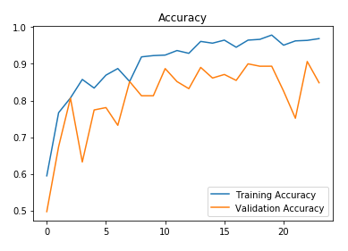

# Brain-Tumor-Detector
Building a detection model using a convolutional neural network in Tensorflow & Keras.<br>
Used a brain MRI images data founded on Kaggle. You can find it [here](https://www.kaggle.com/navoneel/brain-mri-images-for-brain-tumor-detection).<br>


**About the data:**<br>
The dataset contains 2 folders: yes and no which contains 253 Brain MRI Images. The folder yes contains 155 Brain MRI Images that are tumorous and the folder no contains 98 Brain MRI Images that are non-tumorous.


# Getting Started

**Note:** sometimes viewing IPython notebooks using GitHub viewer doesn't work as expected, so you can always view them using [nbviewer](https://nbviewer.jupyter.org/).

## Data Augmentation:

**Why did I use data augmentation?**

Since this is a small dataset, There wasn't enough examples to train the neural network. Also, data augmentation was useful in taclking the data imbalance issue in the data.<br>

Further explanations are found in the Data Augmentation notebook.

Before data augmentation, the dataset consisted of:<br>
155 positive and 98 negative examples, resulting in 253 example images.

After data augmentation, now the dataset consists of:<br>
1085 positive and 980 examples, resulting in 2065 example images.

**Note:** these 2065 examples contains also the 253 original images. They are found in folder named 'augmented data'.

## Data Preprocessing

For every image, the following preprocessing steps were applied:

1. Crop the part of the image that contains only the brain (which is the most important part of the image).
2. Resize the image to have a shape of (240, 240, 3)=(image_width, image_height, number of channels): because images in the dataset come in different sizes. So, all images should have the same shape to feed it as an input to the neural network.
3. Apply normalization: to scale pixel values to the range 0-1.

## Data Split:

The data was split in the following way:
1. 70% of the data for training.
2. 15% of the data for validation.
3. 15% of the data for testing.

# Neural Network Architecture

This is the architecture that I've built:


**Understanding the architecture:**<br>
Each input x (image) has a shape of (240, 240, 3) and is fed into the neural network. And, it goes through the following layers:<br>

1. A Zero Padding layer with a pool size of (2, 2).
2. A convolutional layer with 32 filters, with a filter size of (7, 7) and a stride equal to 1.
3. A batch normalization layer to normalize pixel values to speed up computation.
4. A ReLU activation layer.
5. A Max Pooling layer with f=4 and s=4.
6. A Max Pooling layer with f=4 and s=4, same as before.
7. A flatten layer in order to flatten the 3-dimensional matrix into a one-dimensional vector.
8. A Dense (output unit) fully connected layer with one neuron with a sigmoid activation (since this is a binary classification task).

**Why this architecture?**<br>

Firstly, I applied transfer learning using a ResNet50 and vgg-16, but these models were too complex to the data size and were overfitting. Of course, you may get good results applying transfer learning with these models using data augmentation. But, I'm using training on a computer with 6th generation Intel i7 CPU and 8 GB memory. So, I had to take into consideration computational complexity and memory limitations.<br>

So why not try a simpler architecture and train it from scratch. And it worked :)

# Training the model
The model was trained for 24 epochs and these are the loss & accuracy plots:




The best validation accuracy was achieved on the 23rd iteration.

# Results

Now, the best model (the one with the best validation accuracy) detects brain tumor with:<br>

**88.7%** accuracy on the **test set**.<br>
**0.88** f1 score on the **test set**.<br>
These resutls are very good considering that the data is balanced.

**Performance table of the best model:**

| <!-- -->  | Validation set | Test set |
| --------- | -------------- | -------- |
| Accuracy  | 91%            | 89%      |
| F1 score  | 0.91           | 0.88     |

# Ensemble Techniques

To further improve the detection accuracy, we implemented several ensemble techniques. Ensemble methods combine multiple models to produce better predictive performance than could be obtained from any of the constituent models alone.

## Implemented Ensemble Methods

### 1. Voting Ensemble
The primary ensemble method uses a majority voting approach:
- Multiple models make independent predictions
- Final prediction is determined by the majority vote of models
- In case of a tie, the average probability is used as a tiebreaker
- This approach reduces errors from individual models by relying on consensus

### 2. Averaging Ensemble
- Takes the mean probability across all models
- Helps smooth out prediction errors when models are uncertain
- Available as an alternative method in the ensemble implementation

### 3. Weighted Ensemble
- Assigns different weights to models based on their individual performance
- Models with higher accuracy get higher weights
- Allows better-performing models to have more influence on the final prediction

## Model Diversity Strategies

The ensemble implementation uses several strategies to ensure model diversity:

1. **Architecture Diversity**: Four different model architectures:
   - Two base models with identical architecture but trained with different weights
   - A variant with smaller filter sizes and pooling parameters
   - A more complex variant with an additional convolutional layer

2. **Weight Diversity**: Using model checkpoints from different training epochs:
   - Best model (epoch 23 with 91% accuracy)
   - Models from epochs 19, 15, and 11 with varying performance

3. **Optimizer Diversity**: Using different optimizers for each model:
   - Adam with learning rate 0.001
   - RMSprop with learning rate 0.001
   - Adam with learning rate 0.0005
   - SGD with learning rate 0.001

# Project Files Overview

## Python Scripts

### 1. `detect_tumor.py`
The main implementation script that:
- Creates and trains the model from scratch
- Implements brain contour cropping for preprocessing
- Includes a full pipeline from training to prediction
- Tests the model on sample images from yes/no directories
- Provides detailed output for each prediction

### 2. `predict.py`
A lighter script focused on prediction that:
- Loads the pre-trained model with the best weights
- Preprocesses input images
- Makes predictions and displays confidence scores
- Visualizes results with prediction information overlaid on images
- Saves prediction results to a timestamped directory
- Calculates overall accuracy statistics

### 3. `quick_test.py`
A script for rapid testing that:
- Loads a small subset of the data
- Trains a simplified model for just 5 epochs
- Saves the model after training
- Tests on a few sample images
- Useful for testing the entire pipeline quickly

### 4. `ensemble_predict.py`
An advanced prediction script implementing ensemble methods:
- Creates multiple model variants with different architectures
- Loads weights from different training epochs
- Implements voting, averaging, and weighted ensemble methods
- Uses model diversity techniques for better performance
- Visualizes and saves ensemble prediction results
- Compares accuracy with the single model approach

## Jupyter Notebooks

### 1. `Data Augmentation.ipynb`
A notebook that:
- Explains the data augmentation process in detail
- Implements image transformations using ImageDataGenerator
- Provides before/after statistics about the dataset
- Shows how augmentation addresses class imbalance

### 2. `Brain Tumor Detection.ipynb`
The main notebook containing:
- Complete data preprocessing pipeline
- Model architecture implementation
- Training process with validation
- Performance evaluation on test data
- Visualizations of results and model performance

## Data Directories

- `yes/`: Contains 155 brain MRI images with tumors
- `no/`: Contains 98 brain MRI images without tumors
- `augmented data/`: Contains 2065 images after augmentation
- `models/`: Contains saved model weights from different training epochs
- `logs/`: Contains training logs and TensorBoard data

# Final Notes

## How to Run the Project

1. Install the required dependencies:
```
pip install -r requirements.txt
```

2. To use the pre-trained model for single model prediction:
```
python predict.py
```

3. To use ensemble techniques for improved prediction:
```
python ensemble_predict.py
```

4. To train a new model from scratch:
```
python detect_tumor.py
```

5. For a quick test of the full pipeline:
```
python quick_test.py
```

## Testing Your Own Images

To test your own brain MRI images:
1. Place your images in a directory
2. Modify the path in either `predict.py` or `ensemble_predict.py`
3. Run the script to get predictions with confidence scores and visualizations

## Comparing Ensemble vs Single Model

The ensemble approach typically achieves higher accuracy than the single model approach by:
1. Reducing variance through model averaging
2. Reducing bias by using diverse model architectures
3. Being more robust to outliers and difficult cases
4. Providing more reliable confidence scores

Contributes are welcome!
<br>Thank you!


